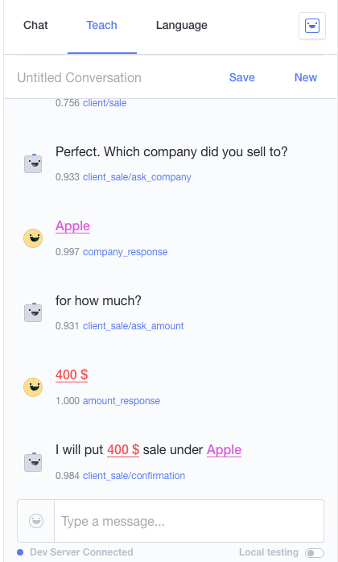
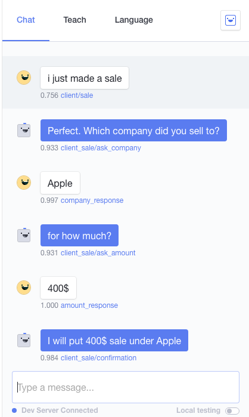
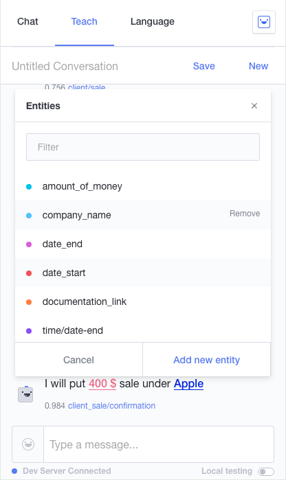
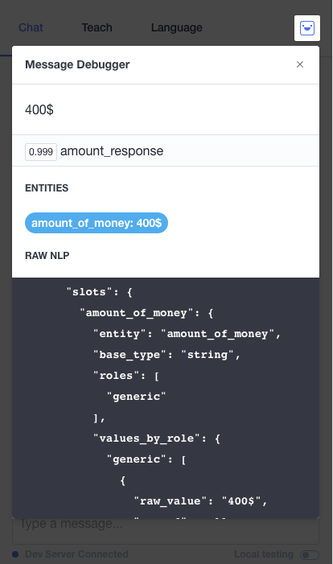

# Boo

The goal of this BOT is to extract key information from the conversation with the user and send this information to the back-end of our project.

We use an NPM library called Axios to do the http request from our server.

Our BOT was integrated with Facebook Messenger.
## Demo
* Click link below to see demo presentation of the Sales Bot Project
* [Sales Bot Demo](https://www.youtube.com/watch?v=KC0GPHN8mYs)

## Development

See the [Quickstart](http://docs.init.ai/docs/quickstart) for details on setting up your development environment

### Installation

#### Node.js version

To [run your scripts locally](http://docs.init.ai/docs/dev-server#section-local-testing), you should make sure to use Node.js version 4.3.2.

We recommend using [nvm](https://github.com/creationix/nvm) to easily manage Node.js versions on your machine. This project is pre-provisioned with an `.nvmrc` file so you may simply run:

```bash
$ nvm use
```

#### Install dependencies

```bash
$ npm i
```

### Usage

#### Start the Dev Server

```bash
$ npm start
```


## Examples





## Authors
* [Randy Klose](https://github.com/Randyklose)
* [Joseph Melanson](https://github.com/joemelanson)
* [Anthony Desormeau](https://github.com/ajdez)
